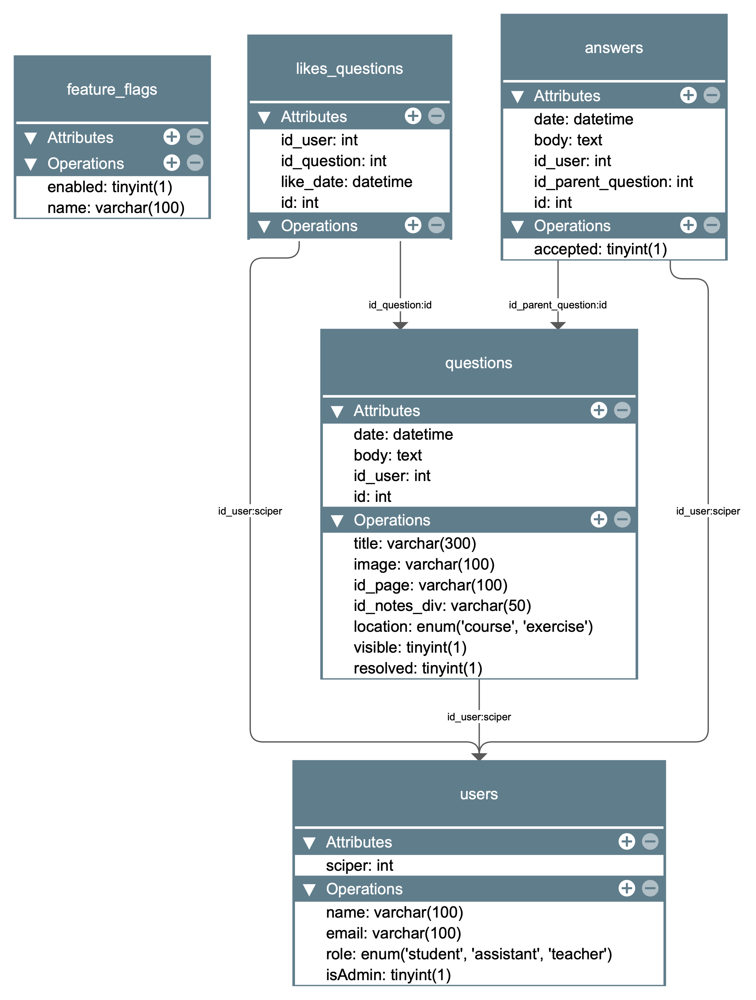

# REST API for the Analysis I forum

## Description
This is a REST API for the Analysis I forum written in PHP. 

## Set up the project
1. Clone the repository: `git clone git@github.com:hadriensevel/forum-rest-api.git`
2. Navigate to the project directory: `cd forum-rest-api`
3. Run [Composer](https://getcomposer.org) to install the dependencies: `composer update`
4. Create a MySQL database and import the `database.sql` file. Via command-line, you can do this by running the following command: `mysql -u <username> -p <database_name> < database.sql`
5. Copy the `inc/config.example.php` file to `inc/config.php and fill in the configuration with your database credentials and other settings.
6. Configure your web server. If you're using Apache, add the following lines to your `.htaccess` file located in the project root. If the file doesn't exist, create a new `.htaccess` file and add the following content:
    ```apache
    RewriteEngine On
    RewriteCond %{REQUEST_URI}  !(\.png|\.jpg|\.webp|\.gif|\.jpeg|\.zip|\.css|\.svg|\.js|\.pdf)$
    RewriteRule (.*) routes.php [QSA,L]
    ```
    Note: For other web servers like Nginx, you need to adjust the configuration accordingly. Here is an example for Nginx:
    ```nginx
    location / {
        try_files $uri $uri/ /routes.php?$query_string;
    }
    ```
7. Set the correct file permissions. Ensure that the web server has read access to the project files and write access to the folders where file uploads or caching might occur.

## Diagram of the database
